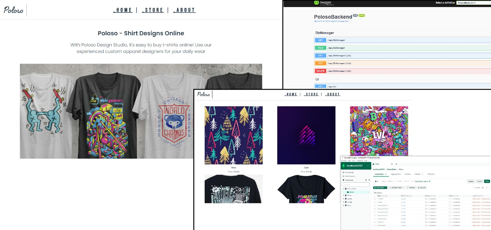

# Practice website with MongoDB, .NET and Vuejs




# frontend

## Project setup
```
npm install
```

### Compiles and hot-reloads for development
```
npm run serve
```

# backend

## 
```
dotnet build
```

## 
```
dotnet run
```
